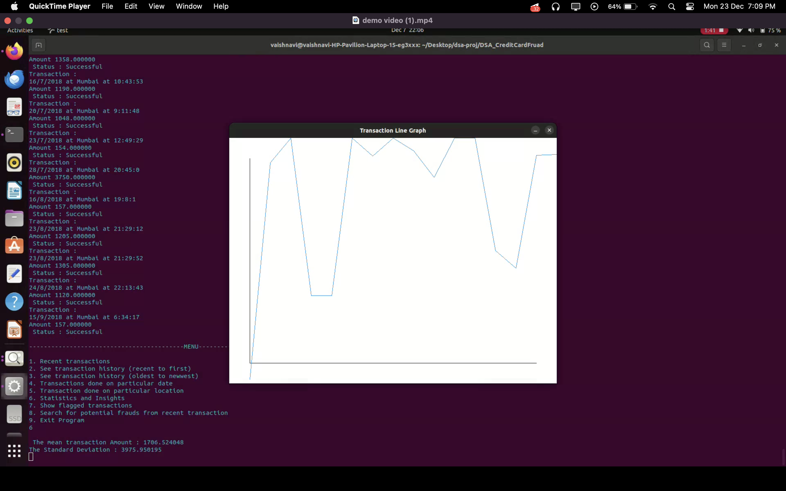

# **Credit Card Fraud Detection System**

## Demo
Click on the thumbnail and download the video to watch it! 

**Project Synopsis:** Credit card fraud is a significant problem in the financial industry, resulting in billions of dollars in losses annually. Traditional fraud detection systems often rely on manual reviews and simple rule-based systems, which can be time-consuming and ineffective. This project aims to develop a more efficient and accurate system using advanced data structures and algorithms
The project will focus on developing a robust and efficient system that can analyze datasets of credit card transactions and detect fraudulent activities. The system will utilize a combination of data structures, including hashmap,doubly linked lists, and binary search trees, to store and process transaction data.

**Data Structures Employed:**
- Hash-map: Used to store statistical data such as mean, standard deviation and to maintain references to linked lists and BST nodes for multiple users.
- Binary Search Tree (BST): Employed for efficient storage and retrieval of transaction amounts and statuses, allowing for quick look up based on dates.
- Linked List: Utilised to track transactions based on timestamp and location, supporting chronological ordering and traversal of transaction history.

**Data Flow and Integration:**
At program execution, user enters his/her credit card number and password, and after the login is successful, transaction data is loaded into data structures. 
A menu driven program to search for transaction (based on date and location), showing flagged transactions and predicting the possibility for fraud.

**Fraud Detection:**
- if multiple failed transaction occur in a short span of time, they are a sign of potential fraud and will be flagged as the same.
Monitor the time intervals between consecutive transactions. Flag any transactions with unusually short time intervals as potential fraud.
- if the location of the current transaction is significantly different from the previous transaction’s location.
- if neither time nor location anomalies are detected, apply a z-score-based statistical method to compare the current transaction amount against the user’s spending pattern. If the z-score exceeds a predefined threshold, flag it as a potential fraud.

**Algorithms:**
1. Naive Bayes: Predicts whether a transaction is fraudulent based on historical data and probabilities.
2. Z-Score Calculation: Flags transactions significantly deviating from a user’s average spending.
3. Time Interval Analysis: Detects rapid consecutive transactions, which could indicate suspicious activity.
4. Location Anomaly Check: Flags geographically inconsistent transactions in short time intervals.

## References used : 
* [Krish Naik's Naive Bayes Tutorial](https://www.youtube.com/watch?v=7zpEuCTcdKk&t=721s)
* [A Credit card fraud detection using Naïve Bayes and Adaboost Research Paper](https://www.ijser.org/researchpaper/A-Credit-card-fraud-detection-using-Naive-Bayes-and-Adaboost.pdf)
* [Naïve Bayes classifiers - Article by IBM](https://www.ibm.com/topics/naive-bayes)

## Datasets Employed
* [Generating Credit Card Details for users](https://www.akto.io/tools/credit-card-generator)
* [Password Generator](https://www.akto.io/tools/password-generator)
* [Daily Transaction Dataset from Kaggle](https://www.kaggle.com/datasets/prasad22/daily-transactions-dataset)
* [Generate Credit Card Transaction Data](https://github.com/namebrandon/Sparkov_Data_Generation)

